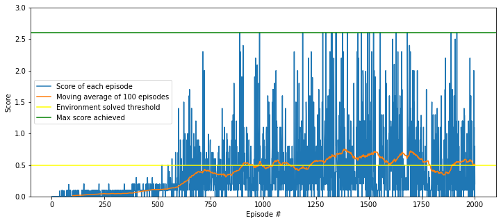

# Solving the Unity Reacher Environment

### 1. Introduction
This project is part of Udacity Deep Reinforcement Nanodegree. 
The objective of this project is to apply Deep Deterministic Policy Gradient ("DDPG") 
([Lillicrap et al., 2016](https://arxiv.org/pdf/1509.02971.pdf)) algorithm to solve the Unity Tennis environment. 

In this environment, two identical agents control rackets to bounce a ball over a net. If an agent hits the ball over the net, it receives a reward of +0.1. If an agent lets a ball hit the ground or hits the ball out of bounds, it receives a reward of -0.01. Thus, the goal of each agent is to keep the ball in play.

The observation space consists of 8 variables of the ball and rackets, corresponding to the position and velocity.  Two continuous actions are available, corresponding to movement toward (or away from) the net, and jumping. 

The environment is considered solved when the average (over 100 episodes) of those scores is at least +0.5.

### 2. Learning Algorithm
The Tennis environment requires the agent to learn from high dimensional state space and perform actions in continuous action space. In this project, a multi-agent variant of the Deep Deterministic Policy Gradient ("DDPG") 
([Lillicrap et al., 2016](https://arxiv.org/pdf/1509.02971.pdf)) algorithm was used to solve the environment. 

DDPG learns the optimal action-value function and then define the best action to perform.
Two deep neural networks are used, namely the actor and the critic. 
The actor is used to approximate the optimal policy deterministically, 
whereas the critic learns to evaluate the optimal action value function by using the actor's best-believed action.

The DDPG implementation uses several methodologies for improving performances:
- Replay buffer: use a buffer of previous experiences to learn across a set of uncorrelated events
- Soft-update to target networks: each network have two copies of network weights, the target networks are updated by slowly blending regular network weights with target network weights
- Ornstein-Uhlenbeck process: adds a certain amount of noise correlated to previous noise to the action values at each timestep, allowing exploration of action space with more continuity

The Multi Agent DDGP ("MADDPG") algorithm ([Lowe et al., 2017](https://arxiv.org/pdf/1706.02275.pdf)) further extends the DDPG algorithm to multi-agent enivronments by using separate observations of each agent to tran the corresponding actor network, but all agent observations are used to train the critit networks. This allows agents to act independently from one another in the environment, while allowing full state observations to be used for training.

### 3. Implementation

#### 3.1 Network Architecture
The MADDPG algorithm was implemented using one Actor (Policy) network and one Critic (Value) network for each agents.
Both actor and critic networks share the same architecture, except for the output size.
Both actor and critic networks have an input layer with size of state dimesion 24, 
followed by two hidden layers of size 128 and 64 respectively.
The output layer of the actor network has size 2 (same as action dimension), 
while the output layer of the critic network has size 1.

Rectifier Linear Units (ReLU) activation functions were used after the first two layers both networks. 
The output layer of the actor network used tanh activation function. The optimization emloyed to train the network was the Adam optimization algorithm.

#### 3.2 Hyperparameters

The hyperparameter chosen were as follows:

|Hyperparameter|Value|
|:-|-:|
|Replay buffer size| 100,000 |
|Minibatch size| 128 |
|Discount factor (gamma)| 0.99 |
|Soft update of target parameters (tau) | 0.001 |
|Learning rate (both actor/critic) | 1e-3|
|L2 weight decay|0|

### 4. Performance Evaluation

The figure below illustrates the learning of an agent using MADDPG algorithm.

After episode #904 the environment was solved with average score of 0.5216 over last 100 episodes. The training continued till 2000 episodes.

### 5. Extensions

During training process, it is observed that the training result appears to be highly dependent on the initial random seed. Some seeds allow the agents to solve the environment relatively quickly within a few hundred episodes, while for some seeds the average score was still 0.0 even after 1000 episodes. Further exploration could be done to address this issue. In addition, further work could be done to improve the hyperparameters selection (e.g. with grid search).
